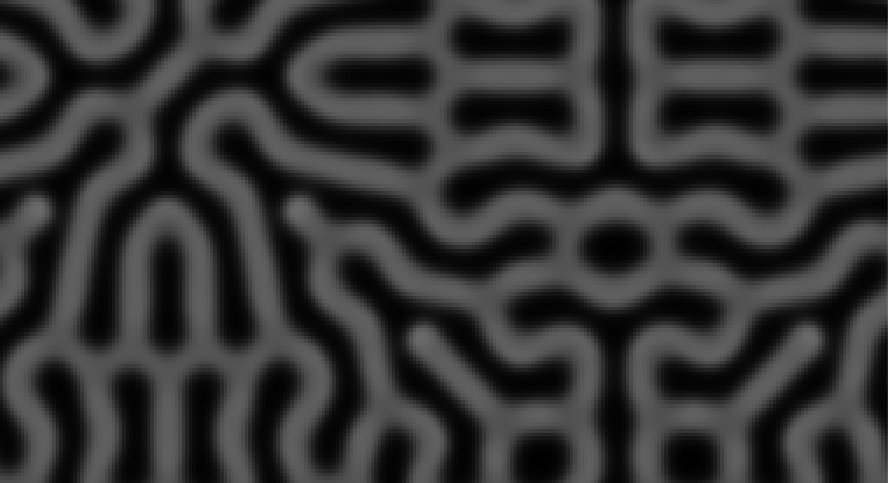

# Turing patterns in java

## About Turing patterns
Turing patterns are a type of pattern formation that can be observed in nature. They are named after the mathematician Alan Turing, who first described them in his 1952 paper "The Chemical Basis of Morphogenesis". The basic idea is that you have two chemicals that diffuse at different rates, and that react with each other in a non-linear way. This can lead to the formation of complex patterns, such as spots, stripes, or spirals. Say you have a grid of cells, each of which contains a concentration of two chemicals. The chemicals diffuse across the grid, and react with each other according to some reaction-diffusion equations. The result is that you get patterns forming in the concentrations of the chemicals.

## Some mathematics about the RD system
This implementation models a reaction-diffusion system on a two-dimensional grid. Each cell in the grid contains two chemical species, `A` and `B`. The concentrations of these chemicals evolve over time due to diffusion and non-linear reactions, following Turing's theory of morphogenesis. The model uses the Gray-Scott equations:

For each cell $(x, y)$ in the grid, the concentrations of chemicals $A$ and $B$ are updated using the following equations:

$$
\frac{dA}{dt} = D_A \cdot \nabla^2 A - A B^2 + f (1 - A)
$$

$$
\frac{dB}{dt} = D_B \cdot \nabla^2 B + A B^2 - (k + f) B
$$

Where:
- $D_A$ and $D_B$ are the diffusion rates of chemicals $A$ and $B$, respectively.
- $f$ (feed) and $k$ (kill) are parameters that control the rates of feeding and removal of chemicals in the system.
- The Laplacian term ($\nabla^2$) represents the diffusion process by summing the concentrations of neighboring cells and subtracting the current cell's value.

To simulate a continuous surface, this repo implements periodic boundary conditions––for smoother and more continuous patterns.

**Initial conditions**
Initially, the grid is filled with a uniform concentration of $A$ and a very low concentration of $B$. Random perturbations are introduced in the concentration of $B$ for approximately 5% of the cells. These perturbations act as seeds for pattern formation, allowing complex structures to emerge as the chemicals react and diffuse.

## Getting started
1. Clone the repository
2. Open the project in your favorite IDE, and make sure you have the JDK installed
3. Run `java TuringPatternSimulator` in your terminal
